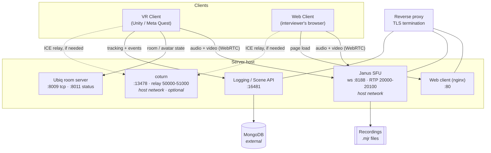

# Architecture

InterView is five services plus two clients. Nothing is co-dependent at startup -
each service can be restarted on its own - but a session needs all of them.

## Components



!!! warning "The reverse proxy is not part of this stack"
    Janus, the logging API and the web client all speak **plain HTTP/WS**. TLS
    termination and hostname routing are handled by a reverse proxy that this
    repository does not deploy or configure. Clients are configured with `wss://`
    and `https://` URLs, so **without that proxy in front, nothing connects**.
    See [Setup step 1](setup.md#1-prerequisites).

## Responsibilities

| Service | Does | Does not |
|---|---|---|
| **Janus** | Carries live audio/video between the two participants. Hosts the control data channel. Writes recordings. | Store anything but recordings. Know about tokens or participants. |
| **coturn** | Relays media when a direct peer connection cannot be established. | Anything else. Entirely optional. |
| **Ubiq** | Keeps VR room state - avatars, transforms, ownership - in sync. | Touch audio or video. |
| **Logging API** | Accepts tracking samples, events and answers; writes them to MongoDB. Serves scene definitions. | Take part in the live call. |
| **Web client** | Serves static interviewer and interviewee pages. | Any server-side logic. It is plain nginx. |

## Two media plugins, two jobs

Janus carries more than the call. Both clients attach **two** plugin handles to
the same room:

- **`janus.plugin.videoroom`** - the audio and video streams themselves.
- **`janus.plugin.textroom`** - a WebRTC data channel used as the control bus.
  Recording start/stop, answer options pushed to the participant, gaze overlay
  updates, chat messages and follow-up prompts all ride this channel.

This matters operationally: **if data channels break, the call still works but
the interview does not.** The participant will see and hear the interviewer while
no answer options appear. Data channels require `usrsctp`, which is why the Janus
image builds it explicitly.

!!! tip "The control channel is treated as unreliable"
    The web client re-broadcasts recording state on a heartbeat rather than
    sending it once, because a single message on the text channel can be missed.
    Keep that in mind before "simplifying" it.

## Token and room derivation

There is no session registry or matchmaking service. Both clients derive every
identifier from the **participant token** using the same function, so they land in
the same room independently:

```
token ──┬─→ Janus room ID   = numeric if the token is all digits,
        │                     otherwise DJB2 hash (seed 5381, ×33), abs, min 1
        ├─→ Ubiq room name  = "interview-{token}"
        └─→ questionnaire   = {BrowserBaseUrl}?token={token}&room={token}
```

The implementation exists twice and the two **must** stay identical:

| Side | Location |
|---|---|
| VR client | `InterviewTokenManager.RoomIdFromString()` |
| Web client | `roomIdFromString()` in `js/state.js` |

!!! danger "Changing one without the other silently splits the interview"
    Interviewer and participant would each sit alone in a different room, with no
    error shown. If you touch either function, change both.

Media rooms are **created on demand** by whichever client arrives first. Only the
static demo room `1234` is pre-declared in the plugin configs.

## Data flow after a session

Two separate artefacts come out of an interview, joined by the token:

1. **Recordings** - Janus writes `.mjr` files (one per media track, per
   participant) to the recordings directory. These need post-processing before
   they are playable; see [Operations](operations.md#recordings).
2. **Logged data** - tracking samples, events and answers, written continuously
   to MongoDB through the logging API.

## Network ports

Defaults as deployed. Ports marked *host* come from the service's own config file,
not from `docker-compose.yml`.

| Service | Container | Host | Public | Notes |
|---|---|---|---|---|
| Janus (WebSocket API) | 8188 | 8188 *(host)* | via proxy as `wss://` | Primary client transport |
| Janus (HTTP API) | 8088 | 8088 *(host)* | not exposed | Enabled but unused by the clients |
| Janus (RTP/ICE) | 20000-20100/udp | same *(host)* | direct | Must be open in the firewall |
| coturn | 13478 | 13478 *(host)* | 3478 | Public port is mapped down by the firewall |
| coturn (relay) | 50000-51000/udp | same *(host)* | direct | Must not overlap Janus's RTP range |
| Ubiq (room server) | 8009 | 16485 | direct | Unity client connects here |
| Ubiq (status) | 8011 | 16486 | - | Metrics |
| Logging API | 16481 | 16481 | via proxy | Requires `X-API-KEY` |
| Web client | 80 | 18800 | via proxy | Static nginx |

!!! note "Why Janus and coturn use host networking"
    Both need to see the real network interface to gather usable ICE candidates,
    and both use large UDP port ranges that would be impractical to publish
    individually. This is a requirement, not a convenience.
